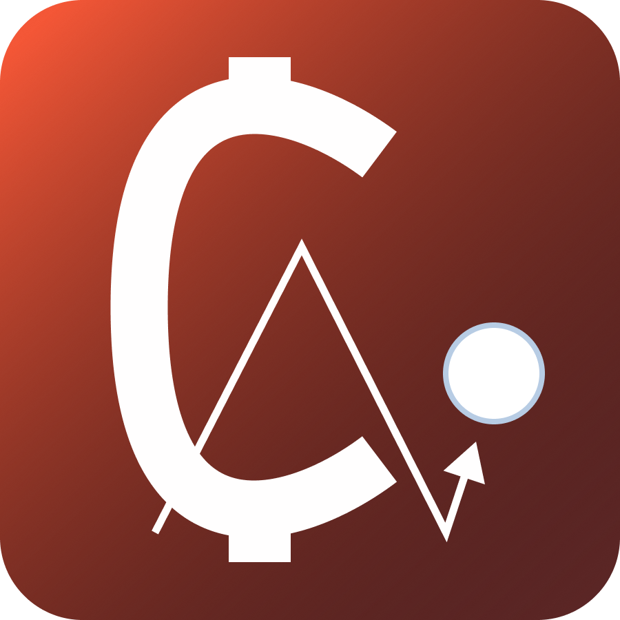
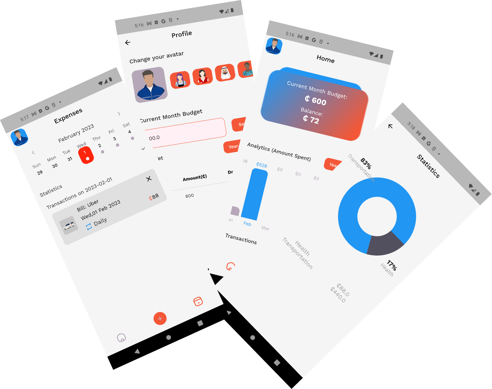

## Tracedi   

> 

### Project Description
This app help users track their spending and also maintain a healthy budget. The app provides its
user with a graphical understanding of their expenses.

### Features
<ul style="list-style-type: none;">
    <li>:point_right: Record recurring and non recurring bills</li>
    <li>:point_right: View statistics</li>
    <li>:point_right: Update bills</li>
    <li>:point_right: Set monthly budgets</li>
    <li>:point_right: In built calculator</li>
    <li>:point_right: Beautiful UI</li>
</ul>

### To be added:
<li>Export reports</li>

### State Manager
<a href="https://pub.dev/packages/flutter_bloc">Bloc</a>

### Assets

    <a href="https://www.svgrepo.com/">SVG Repo</a>

<a href="https://syaluiux.gumroad.com/l/Xnix500">Xnix Icon pack</a>

Preview

### Tech Stack
Mobile App: Flutter | dart
